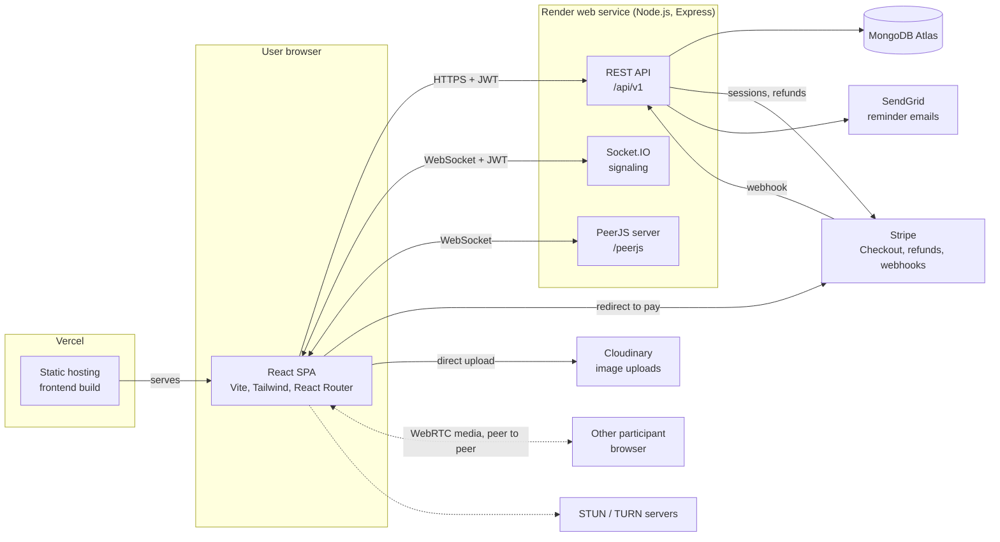
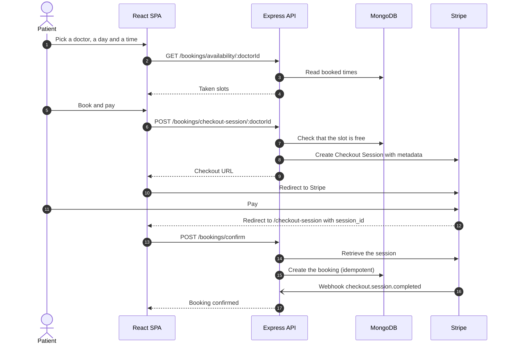
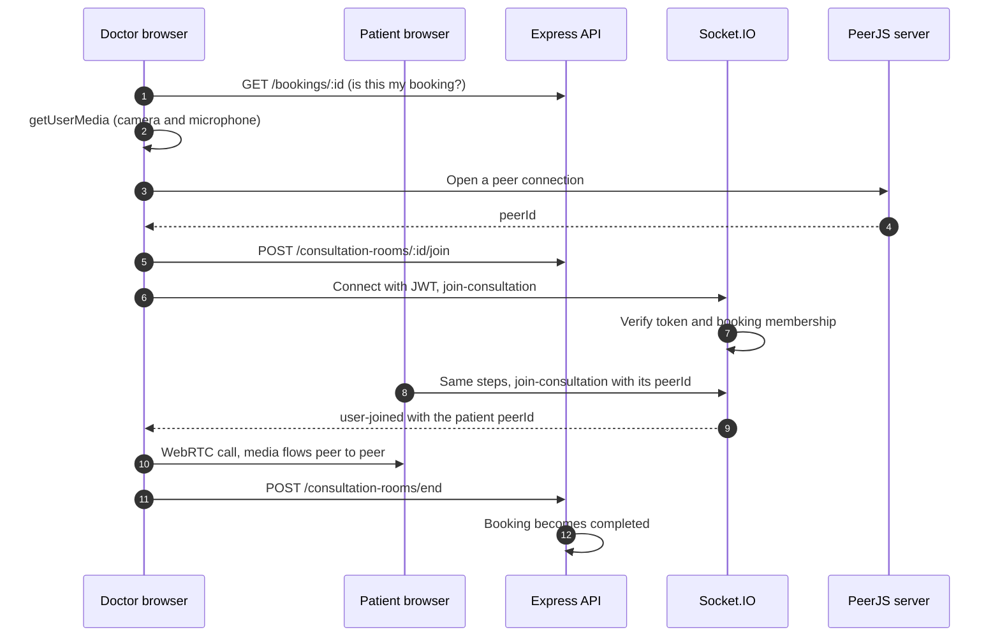
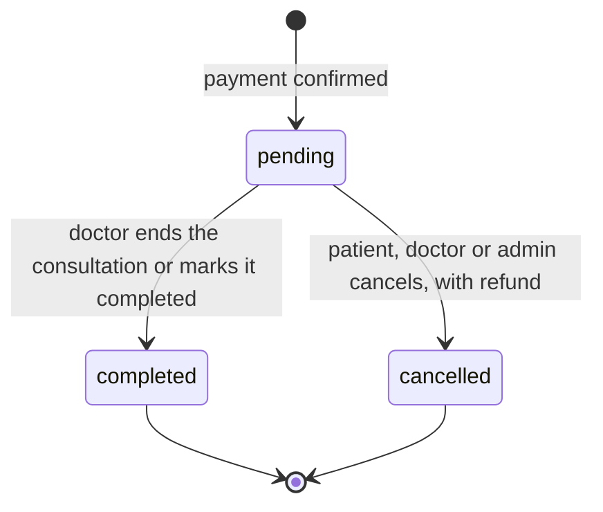
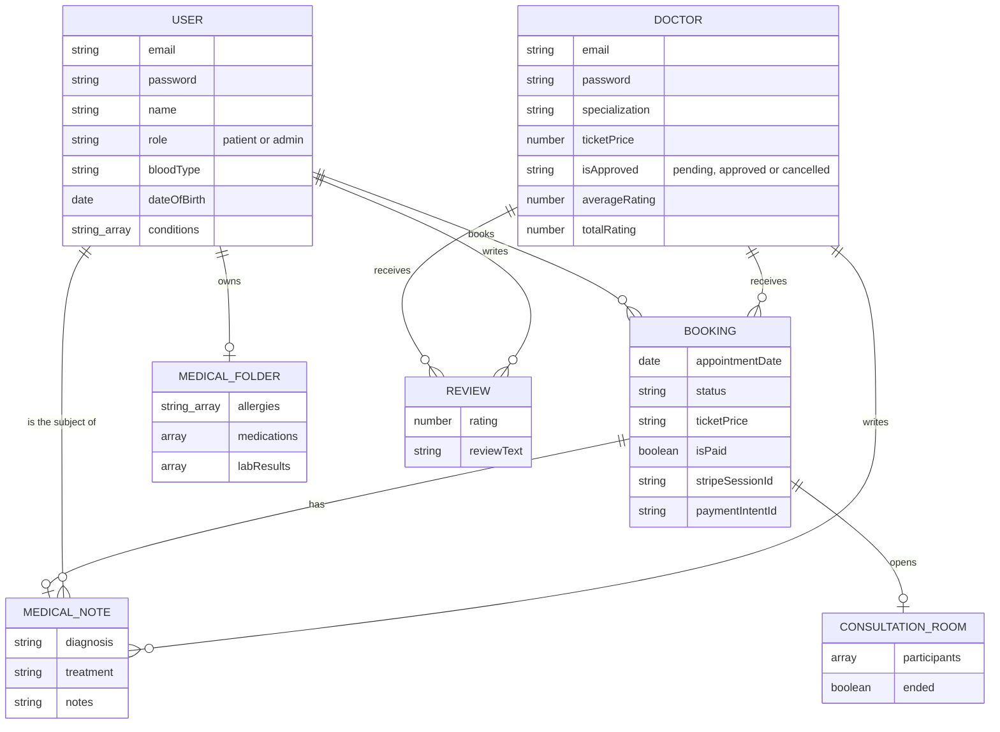

# Tabibi

Telemedicine platform. Patients book and pay for video consultations with
licensed doctors, doctors manage appointments and medical records, and admins
moderate the platform.

> **Proprietary software. All rights reserved.** See [LICENSE](./LICENSE).
> Viewing the code to evaluate the work is fine. Running, copying or
> redistributing it requires written permission from the author.

## Table of contents

- [Features](#features)
- [Tech stack](#tech-stack)
- [Architecture](#architecture)
- [Project structure](#project-structure)
- [Getting started](#getting-started)
- [Environment variables](#environment-variables)
- [API overview](#api-overview)
- [Deployment](#deployment)
- [Security](#security)
- [Roadmap](#roadmap)
- [Author](#author)

## Features

**Patients**

- Sign up, log in, manage a personal profile (photo, blood type, conditions)
- Browse and search approved doctors, read reviews
- Pick a day and a time slot, pay securely with Stripe Checkout
- Join the video consultation from the browser, nothing to install
- Personal medical folder: allergies, medications, lab results, doctor's notes
- Cancel an appointment and get an automatic refund
- Review a doctor after a completed consultation
- Delete the account (paid upcoming appointments are refunded first)

**Doctors**

- Public profile: specialization, fee, qualifications, experience
- Dashboard with upcoming appointments, stats and a profile checklist
- Join the call, send reminder emails, mark appointments as completed
- Write and edit medical notes, update a patient's medical folder
- Access limited to patients who have a booking with the doctor

**Admins**

- Separate login, overview with the doctors waiting for review
- Approve, reject, suspend and re-approve doctors
- Manage patients and bookings, analytics (bookings per month, revenue, status breakdown)

**Platform**

- JWT authentication with roles (patient, doctor, admin)
- Rate limiting on login and signup
- Stripe Checkout with a webhook as a safety net, idempotent booking creation
- Email reminders with SendGrid
- Direct image uploads to Cloudinary

## Tech stack

| Layer | Technology |
| --- | --- |
| Frontend | React 18, Vite, React Router, Tailwind CSS, Chart.js, Swiper, lucide-react |
| Backend | Node.js 20+, Express, Mongoose |
| Database | MongoDB Atlas |
| Realtime | Socket.IO (signaling), PeerJS (WebRTC), STUN/TURN |
| Payments | Stripe Checkout, refunds, webhooks |
| Email | SendGrid |
| Media | Cloudinary (image uploads) |
| Hosting | Vercel (frontend), Render (backend) |

## Architecture

### System overview



### Booking and payment flow

A booking is created only after Stripe confirms the payment. The success page
and the webhook both call the same idempotent function, so a booking can never
be created twice.



### Video consultation flow

Media never goes through the server. The server only checks who is allowed in
and passes connection details between the two browsers.



### Booking lifecycle



The `approved` status exists in the schema but no flow uses it yet.

### Data model



### Key design decisions

- **One Node process** serves the REST API, Socket.IO and the PeerJS server on a
  single port, which keeps hosting simple. The `upgrade` event is routed by path
  so the two WebSocket servers do not interfere.
- **Authorization is enforced on the server**, never trusted from the client:
  role checks, ownership checks, and a "has a booking with this patient" check
  for doctors reading medical data.
- **Payments are confirmed server-side.** Booking data travels in Stripe session
  metadata, and bookings are unique per Stripe session.
- **Sensitive medical data is never public.** Unapproved doctors are hidden from
  patients, and passwords are hashed with bcrypt.

## Project structure

```text
.
|-- backend/
|   |-- auth/            JWT verification, rate limiter
|   |-- Controllers/     Request handlers
|   |-- models/          Mongoose schemas
|   |-- Routes/          Express routers
|   |-- scripts/         createAdmin.js
|   `-- index.js         HTTP server, Socket.IO, PeerJS, routes
|-- frontend/
|   |-- public/          Static assets
|   `-- src/
|       |-- components/  Header, Footer, doctor cards, shared UI
|       |-- context/     Authentication context
|       |-- Dashboard/   Admin, doctor and patient dashboards
|       |-- hooks/       Data fetching
|       |-- layout/      Page layouts
|       |-- pages/       Public pages and the video room
|       |-- routes/      Router and protected routes
|       `-- utils/       Helpers (Cloudinary upload, dates)
|-- LICENSE
`-- README.md
```

## Getting started

**Prerequisites:** Node.js 20 or newer, a MongoDB Atlas cluster, a Stripe account
(test mode), a SendGrid account, a Cloudinary account.

```bash
# Backend
cd backend
npm install
cp .env.example .env        # then fill in the values
npm run start-dev

# Frontend (in another terminal)
cd frontend
npm install
cp .env.example .env.local  # then fill in the values
npm run dev
```

The frontend runs on http://localhost:5173 and the API on http://localhost:5000.

**Create the first admin account** (admins cannot be created through the public API):

```powershell
cd backend
$env:ADMIN_EMAIL="you@example.com"; $env:ADMIN_PASSWORD="a-strong-password"; node scripts/createAdmin.js
```

**Test Stripe webhooks locally** with the Stripe CLI:

```bash
stripe listen --forward-to localhost:5000/api/v1/bookings/webhook
```

## Environment variables

### Backend (`backend/.env`)

| Variable | Description |
| --- | --- |
| `PORT` | Server port (set automatically by most hosts) |
| `NODE_ENV` | `development` or `production` |
| `MONGO_URL` | MongoDB Atlas connection string |
| `JWT_SECRET_KEY` | Long random secret used to sign tokens |
| `CLIENT_SITE_URL` | Frontend URL, used for CORS and Stripe redirects |
| `STRIPE_SECRET_KEY` | Stripe secret key |
| `STRIPE_WEBHOOK_SECRET` | Stripe webhook signing secret |
| `SENDGRID_API_KEY` | SendGrid API key |
| `SENDGRID_FROM_EMAIL` | Verified sender address for reminders |
| `APP_TIMEZONE` | Time zone used in emails and charts, default `Africa/Tunis` |

### Frontend (`frontend/.env.local`)

| Variable | Description |
| --- | --- |
| `VITE_API_URL` | API base URL, for example `http://localhost:5000/api/v1` |
| `VITE_CLOUD_NAME` | Cloudinary cloud name |
| `VITE_UPLOAD_PRESET` | Cloudinary unsigned upload preset |
| `VITE_ICE_SERVERS` | Optional JSON array of STUN/TURN servers |

## API overview

All routes are under `/api/v1`. Protected routes expect `Authorization: Bearer <token>`.

| Area | Routes |
| --- | --- |
| Auth | `POST /auth/register`, `POST /auth/login`, `POST /admin/login` |
| Doctors | `GET /doctors`, `GET /doctors/:id`, `GET /doctors/profile/me`, `PUT /doctors/:id`, `PATCH /doctors/approve` |
| Reviews | `GET /doctors/:doctorId/reviews`, `POST /doctors/:doctorId/reviews` |
| Patients | `GET /users/profile/me`, `PUT /users/:id`, `DELETE /users/:id`, `GET /users/appointments/my-appointments` |
| Bookings | `GET /bookings/availability/:doctorId`, `POST /bookings/checkout-session/:doctorId`, `POST /bookings/confirm`, `DELETE /bookings/cancel/:id`, `PATCH /bookings/complete/:id`, `POST /bookings/notify/:id`, `POST /bookings/webhook` |
| Medical data | `GET /medical-folder/:patientId`, `PATCH /medical-folder/:patientId`, `/medical-notes` |
| Video | `POST /consultation-rooms/:bookingId/join`, `POST /consultation-rooms/end` |
| Admin | `GET /analytics/dashboard`, `GET /analytics/booking-trends`, `GET /doctors/pending` |

## Deployment

| Part | Service |
| --- | --- |
| Database | MongoDB Atlas |
| Backend | Render web service, root directory `backend`, start command `npm start` |
| Frontend | Vercel, root directory `frontend`, framework preset Vite |

Set the environment variables above on each service. `CLIENT_SITE_URL` on the
backend must be the exact Vercel URL, and `VITE_API_URL` on the frontend must
be the Render URL followed by `/api/v1`.

## Security

- Passwords hashed with bcrypt, tokens signed with a secret kept outside the repository
- Role-based access control, with ownership and relationship checks on medical data
- Rate limiting on login and signup, generic login errors that do not reveal which emails exist
- Admin accounts created only through a server-side script
- Stripe webhook signature verification, idempotent payment fulfilment
- Strict CORS: only the configured frontend origin is allowed

## Author

Safwen Ben Mabrouk, full-stack software engineer.

- GitHub: [Safwen-bm](https://github.com/Safwen-bm)
- LinkedIn: [safwen-ben-mabrouk](https://linkedin.com/in/safwen-ben-mabrouk)

Copyright (c) 2025-2026 Safwen Ben Mabrouk. All rights reserved.